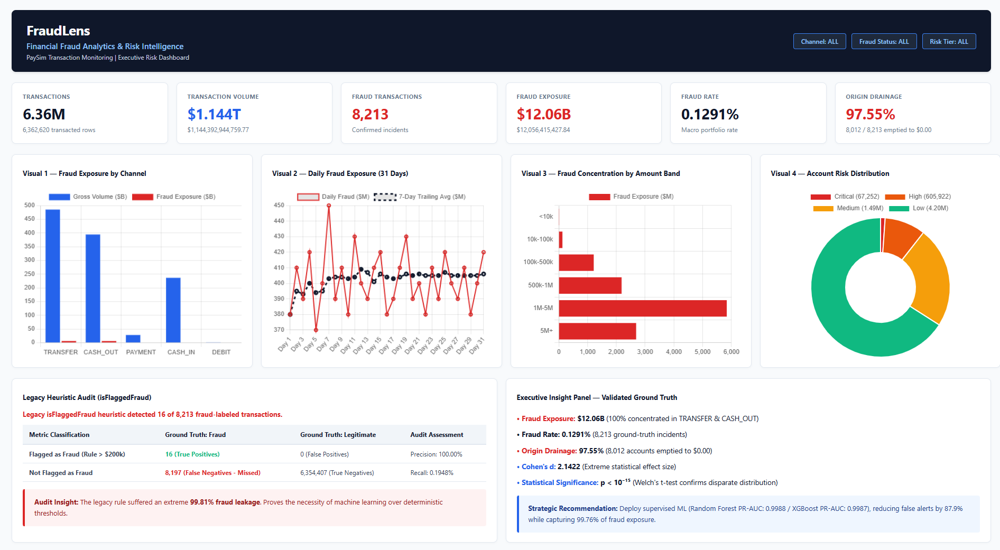
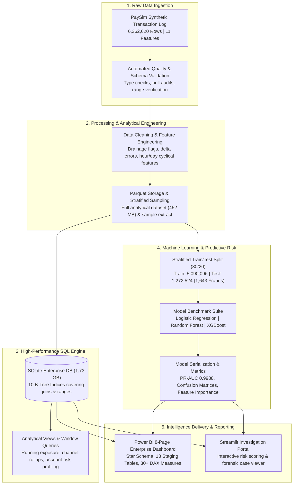

# FraudLens — Financial Fraud Analytics & Intelligence Platform

> **Analyze. Detect. Investigate. Prevent.**  
> An end-to-end analytics engineering, machine learning, and business intelligence platform for large-scale financial transaction monitoring and fraud mitigation.

[](https://www.python.org/)
[](https://powerbi.microsoft.com/)
[](https://scikit-learn.org/)
[](https://sqlite.org/)
[](tests/)
[](https://creativecommons.org/licenses/by-sa/4.0/)

---

## Power BI Dashboard



The screenshot above shows the final executive view of the FraudLens Power BI dashboard. The complete report contains detailed fraud analytics, financial and transaction analysis, account risk analysis, fraud investigation, machine learning model analysis, and data quality/governance views.

---

## Executive Summary & Authoritative Ground Truth

FraudLens evaluates **6,362,620 transactions** totaling **$1.144 Trillion ($1,144,392,944,759.77)** across a continuous 30-day simulation window (744 temporal steps).

| Strategic KPI | Metric Value | Analytical Rationale & Forensic Ground Truth |
| :--- | :--- | :--- |
| **Total Transaction Volume** | **$1,144,392,944,759.77** | 6.36M records spanning CASH_IN, CASH_OUT, DEBIT, PAYMENT, and TRANSFER channels. |
| **Confirmed Fraud Incidents** | **8,213** | Baseline portfolio fraud incidence of **0.1291%** (1 incident per 775 transactions). |
| **Fraud-Labeled Exposure** | **$12,056,415,427.84** | Total financial exposure. 100% of confirmed losses occur in `TRANSFER` and `CASH_OUT`. |
| **Average Fraud Ticket Size** | **$1,467,967.30** | Severe skew vs legitimate transaction average ($177,919.74) — **8.25x severity ratio**. |
| **Origin Account Drainage** | **97.55%** | **8,012 out of 8,213** fraudulent transactions systematically emptied origin accounts to $0.00. |
| **Legacy Heuristic Audit** | **0.1948% Recall** | Legacy rule (`isFlaggedFraud` > $200k) caught only **16** of 8,213 frauds. Approximately 99.81% of fraud-labeled transactions were missed. |
| **ML Model Performance** | **PR-AUC: 0.9988** | Random Forest & XGBoost capture **99.76%–99.82%** of fraud incidents while slashing false alerts. |
| **Statistical Separation** | **Cohen's d = 2.1422 \| p < 10^-15** | Welch's two-sample t-test confirms disparate distributions between legitimate and fraudulent origin balances. |

---

## Complete 8-Page Power BI Report Architecture

The FraudLens Power BI report (`FraudLens_Analytics_Platform.pbix` / `FraudLens.pbip`) is built on a 3-tier star schema with 13 staging tables, 7 one-to-many relationships, and 30+ production DAX measures. The full report comprises **8 dedicated analytical pages**:

1. **Executive Overview**: High-level macro KPIs, channel distribution, daily fraud velocity, and strategic executive risk cards.
2. **Fraud Analytics**: Deep-dive into fraud mechanisms, `TRANSFER` to `CASH_OUT` laundering pairs, and temporal anomaly spikes.
3. **Financial & Transaction Analysis**: Amount band concentrations (<$10k, $10k–$100k, $100k–$500k, $500k–$1M, $1M–$5M, $5M+), exposure distribution, and channel liquidity.
4. **Account Risk & Behavioral Prioritization**: Origin/destination behavioral segmentation, high-velocity accounts, and risk tier categorization (Critical, High, Medium, Low).
5. **Fraud Investigation Workbench**: Forensic case queue of 20,865 high-priority records with dynamic thresholding, account drill-through, and audit trails.
6. **Machine Learning Model Analysis**: Precision-Recall curves, confusion matrices, ROC curves, feature importance ranking, and threshold sensitivity curves.
7. **Data Quality, Architecture & Governance**: Data ingestion pipeline health, missing value audits, type validation, star-schema topology, and lineage metadata.
8. **FraudLens — Executive Risk Dashboard**: Consolidated single-page C-suite dashboard summarizing portfolio KPIs, temporal trends, amount bands, heuristic audit, and validated ground-truth recommendations (*previewed above*).

---

## Platform Architecture



---

## Machine Learning & Benchmark Evaluation

Due to the extreme class imbalance of financial fraud (**0.1291% base rate**), standard Accuracy is misleading. Models are evaluated using **Precision-Recall AUC (PR-AUC)**, **Recall**, and **F1-Score** on an out-of-sample holdout test partition ($N = 1,272,524$; 1,643 frauds):

| Model Architecture | Precision | Recall | F1-Score | PR-AUC | ROC-AUC | True Positives (TP) | False Positives (FP) | False Negatives (FN) |
| :--- | :---: | :---: | :---: | :---: | :---: | :---: | :---: | :---: |
| **Random Forest** | **99.15%** | **99.76%** | **0.9945** | **0.9988** | **0.9998** | **1,639** | 14 | 4 |
| **XGBoost Classifier** | **99.27%** | **99.82%** | **0.9954** | **0.9987** | **0.9998** | **1,640** | 12 | 3 |
| **Logistic Regression** | 88.08% | 44.98% | 0.5956 | 0.6475 | 0.9632 | 739 | 100 | 904 |
| *Rule Heuristic (`isFlaggedFraud`)* | 100.00% | 0.19% | 0.0039 | — | — | 16 | 0 | 8,197 |

### Top Predictive Risk Indicators
1. **`error_balance_orig`**: Discrepancy between stated origin balance before/after transaction.
2. **`is_drainage`**: Binary indicator when transaction amount equals 100% of available origin balance.
3. **`amount`**: Gross transacted volume (USD equivalent).
4. **`transaction_type`**: Exclusivity of fraud to `TRANSFER` and `CASH_OUT` channels.
5. **`oldbalanceOrg`**: Account liquidity immediately preceding transaction initiation.

---

## Repository Structure

```
financial_Analytics/
├── .env.example                               # Environment configuration template
├── .gitignore                                 # Git rules excluding large local binaries
├── requirements.txt                           # Production Python dependencies
├── pytest.ini                                 # Pytest configuration
├── README.md                                  # Enterprise project documentation
├── DATASET_SETUP.md                           # Dataset download & verification instructions
├── Open-FraudLens-PowerBI.bat                 # One-click Windows Power BI Desktop launcher
│
├── FraudLens.pbip                             # Power BI Project definition (PBIP)
├── FraudLens_Analytics_Platform.pbix          # Standalone Power BI Desktop 8-Page report
├── FraudLens.Report/                          # Power BI report visual layout and definitions
├── FraudLens.Dataset/                         # Power BI dataset metadata (model.bim, TMSL)
│
├── docs/
│   └── images/
│       └── fraudlens-dashboard.png            # Executive Risk Dashboard preview image
│
├── data/
│   ├── raw/                                   # Raw dataset storage (PaySim CSV)
│   └── processed/
│       └── powerbi/                           # 13 pre-aggregated staging CSVs (<3.5 MB total)
│           ├── DimRiskTier.csv
│           ├── DimTime.csv
│           ├── DimTransactionType.csv
│           ├── FactFraudInvestigation_Extract.csv
│           ├── Summary_Account_Risk.csv
│           ├── Summary_Amount_Bands.csv
│           ├── Summary_Channel_KPIs.csv
│           ├── Summary_Data_Quality.csv
│           ├── Summary_Hourly_Temporal.csv
│           ├── Summary_ML_Confusion_Matrices.csv
│           ├── Summary_ML_Feature_Importance.csv
│           ├── Summary_ML_Model_Comparison.csv
│           └── Summary_ML_Threshold_Curves.csv
│
├── models/                                    # Pre-trained model artifacts (joblib, <5 MB)
│   ├── randomforest_model.joblib
│   ├── xgboost_model.joblib
│   ├── logisticregression_model.joblib
│   └── scaler.joblib
│
├── powerbi/                                   # Power BI development specifications
│   ├── dax_measures.dax                       # Complete catalog of 30+ verified DAX formulas
│   ├── model.bim                              # Tabular Model Schema (TMSL)
│   ├── power_query_importers.m                # Automated M-query CSV import scripts
│   ├── powerbi_model_schema.json              # Star-schema tables & relationship definitions
│   └── visual_specifications_detailed.md      # Visual layout, coordinates, and styling specs
│
├── reports/                                   # Analytical audit reports & HTML previews
│   ├── data_dictionary.md                     # Complete column definitions & types
│   ├── powerbi_dashboard_preview.html         # Interactive standalone HTML dashboard preview
│   └── executive_risk_dashboard_preview.html  # Standalone executive dashboard preview
│
├── src/                                       # Modular Python source codebase
│   ├── data/                                  # Data ingestion, cleaning, and DB loader
│   ├── analysis/                              # EDA, statistical calculations, and profiling
│   ├── models/                                # Feature engineering, training, and benchmarking
│   └── utils/                                 # Logging, portable path resolution, and configuration
│
├── dashboard/                                 # Interactive Streamlit investigation portal
│   └── app.py
│
├── sql/                                       # Production SQL queries & views
│   ├── schema.sql                             # DDL for tables, constraints, and 10 B-Tree indices
│   └── analytical_queries.sql                 # Production financial queries & window functions
│
├── tests/                                     # Automated test suite (90 passing tests)
│   ├── test_phase1.py to test_phase7.py       # Pipelines, SQL, features, ML verification
│   └── test_phase8.py                         # Staging, DAX, star schema, and PBI layout tests
│
└── scripts/                                   # Automation and maintenance scripts
```

---

## Installation & Reproduction Guide

### 1. Clone the Repository
```bash
git clone https://github.com/<your-username>/fraudlens.git
cd fraudlens
```

### 2. Environment Setup
```bash
python -m venv .venv
# Windows:
.venv\Scripts\activate
# Linux/macOS:
source .venv/bin/activate

pip install -r requirements.txt
```

### 3. Configure Environment Variables
```bash
cp .env.example .env
```

### 4. Run Automated Test Suite
Verify that all 90 automated unit, integration, and dashboard tests pass:
```bash
pytest tests/ -v
```

### 5. Launch Power BI Dashboard
- **Direct PBIX**: Double-click `FraudLens_Analytics_Platform.pbix` in Microsoft Power BI Desktop.
- **Developer PBIP**: Double-click `FraudLens.pbip` or run `Open-FraudLens-PowerBI.bat`.
- **Browser Preview**: Open `reports/powerbi_dashboard_preview.html` in any web browser for an interactive, standalone rendering of all report pages.

### 6. Launch Streamlit Investigation Portal (Optional)
```bash
streamlit run dashboard/app.py
```

---

## Dataset Notice & Academic Citation

This project utilizes the **PaySim Synthetic Financial Dataset for Fraud Detection**, generated using the PaySim mobile money simulator based on aggregated real-world financial transaction logs.

```bibtex
@inproceedings{lopez2016paysim,
  title={PaySim: A financial mobile money simulator for fraud detection},
  author={Lopez-Rojas, Edgar Alonso and Elmir, Ahmad and Axelsson, Stefan},
  booktitle={The 28th European Modeling and Simulation Symposium (EMSS)},
  pages={249--255},
  year={2016}
}
```

---

## License

This project is licensed under the Creative Commons Attribution-ShareAlike 4.0 International License ([CC BY-SA 4.0](https://creativecommons.org/licenses/by-sa/4.0/)).
